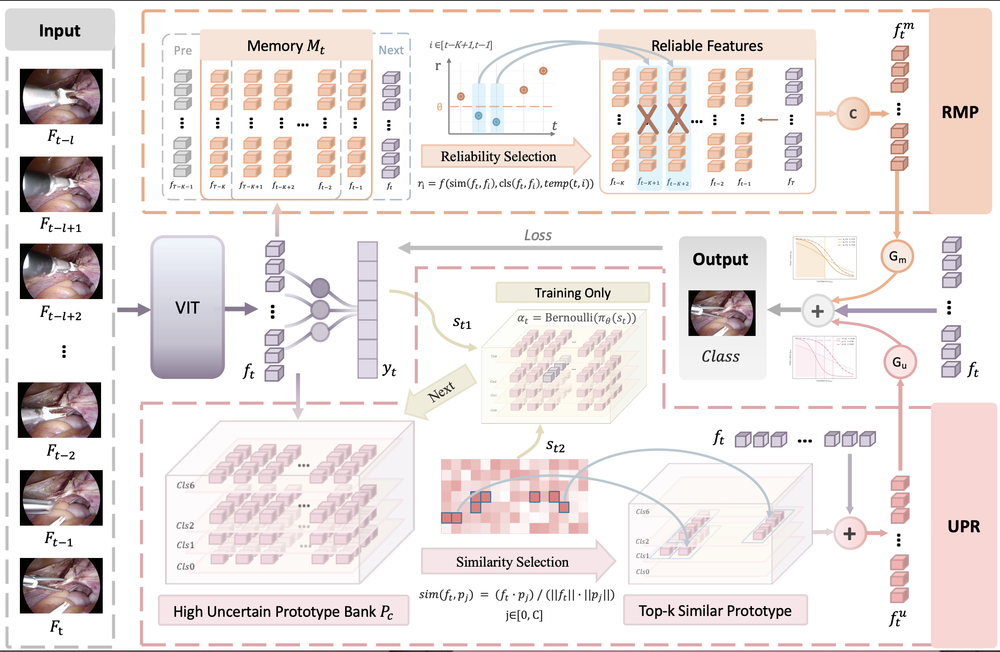

# DSTED
[IJCARS'26] DSTED: Decoupling Temporal Stabilization and Discriminative Enhancement for Surgical Workflow Recognition

---

## Introduction

This repository will provide the official PyTorch implementation of **DSTED**, a dual-pathway framework for surgical workflow recognition.

<p align="center">
  
</p>

Surgical workflow recognition is essential for context-aware assistance and skill assessment in computer-assisted interventions. However, existing approaches often suffer from **prediction jitter across frames** and **poor discrimination of ambiguous phases**.

To address these challenges, we propose **DSTED**, which decouples the learning process into two complementary pathways:

- **Reliable Memory Propagation (RMP)**  
  Enhances temporal stability by selectively propagating high-confidence historical features.

- **Uncertainty-Aware Prototype Retrieval (UPR)**  
  Improves discrimination by constructing class-specific prototypes from uncertain samples and refining ambiguous representations.

A **confidence-driven gating mechanism** dynamically balances both pathways, enabling robust and adaptive temporal reasoning.

---

## Results

DSTED achieves state-of-the-art performance on **AutoLaparo-hysterectomy**:

- **Accuracy:** 84.36%  
- **F1-score:** 65.51%  

Surpassing prior methods by:
- **+3.51% Accuracy**
- **+4.88% F1-score**

Further analysis shows:
- Reduced temporal prediction jitter  
- Improved performance on challenging phase transitions  

---


## Usage

🚧 Code coming soon.

---


## Contact
For any questions, please contact ‘yueyaochen0823@gmail.com’


## Citation

If you find this work useful, please cite:

```bibtex
@article{chen2025dsted,
  title={DSTED: Decoupling Temporal Stabilization and Discriminative Enhancement for Surgical Workflow Recognition},
  author={Chen, Yueyao and Wang, Kai-Ni and Tayupo, Dario and Huaulm'e, Arnaud and Timoh, Krystel Nyangoh and Jannin, Pierre and Dou, Qi},
  journal={arXiv preprint arXiv:2512.19387},
  year={2025}
}
